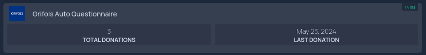

<p align="center">


<h3 align="center">A selfhosted automated questionnaire completion tool</h1>
<br/>
<br/>
</p>


## Disclaimer
- This project is in no way affiliated with any Plasma collection company.
- This project is not meant to be used to replace reading and understanding the questions asked.
- This only works for the short form of questionnaire.
- All user info and images are stored unencrypted
- ⚠️ **Use this at your own risk**

## What is this?

This is self hosted "service" (if you can call it that) which will automatically complete the Grifols plasma donation questionnaire. It is very simple currently, the classic "spend 3 hours building something to save 3 minutes" but it works for what I need currently and has lots of room for more! 

This project is built using [Next.js 14](https://github.com/vercel/next.js) and [Puppeteer](https://github.com/puppeteer/puppeteer)

Current Features: 
- Save donor info
  - there is an option to save donor info, in the future I would like to allow for multiple donors but currently it only supports saving one.
- List all QR Codes
  - Very simple as well, just displays all of the QR codes which have been obtained, future plans include tabs for each donor
- Simeple API
  - Will serve up two values, the date of the last donation and the number of donations (both based on number of qr-codes and most recent date)
- Fully self hosted and local.

## Getting Started

This application can work standalone as well as with docker, though I personally recommend docker for the ease of use.

### With Docker

Using docker compose:

```yaml

version: "3.3"
services:
    g-auto-questionnaire:
        container_name: g-auto-questionnaire
        image: connerwithane/g-auto-questionnaire:latest
        ports:
            - 3000:3000
        restart: unless-stopped
```

Using docker run:
```bash
docker run --name g-auto-questionnaire \
  -p 3000:3000 \
  --restart unless-stopped \
  connerwithane/g-auto-questionnaire:latest
```

### With Node

First, clone the repository:

```bash
git clone https://github.com/connerwithane/g-auto-questionnaire.git
```

Install the packages:

```bash
npm install
```

**For development:**

Run the dev server
```bash
npm run dev
```

**For normal use:**

Build the project
```bash
npm run build
```

Start the server
```bash
npm run start
```


## API

There are multiple endpoints available through the api but only 2 that have any potential use outside of the application
The endpoints are:
```
http://host-ip:port/api/progress
{
  progress: number,
  message: string | undefined
}
```
This is used within the application to pass the current progress updates of the questionnaire to the client view from the server
- progress: a number pertaining to the percentage of the questionnaire completed
- message: a string containing the message from the server about the current progress point, or undefined if there is no new message to send
```
http://host-ip:port/api/images
{
  images: [
    {
    image: string,
    date: string,
    }
  ]
}
```
This is used within the appliation to pass the image data of each QR code to the client for display
- images: a list of custom objects
  - image: a `base64` string of image data to be used by the client
  - date: a string formatted to appear in the `Month Day, Year` format to display alongside the QR image
```
http://host-ip:port/api/getInfo
{
  numberOfImages: number,
  last_donation: string
}
```
This is the only endpoint that is really useful outside of the application, it is used to display info about the QR codes for external use
- numberOfImages: this is a number which displays how many QR codes are currently stored, it can be used to count the "number of donations" by using your QR codes
- last_donation: this is a string formatted to appear in the `Month Day, Year` format grabbed from the most recent QR code 


## Homepage Integration

One of the perks of the api is the ability to integrate with the popular dashboard [Homepage](https://github.com/gethomepage/homepage)

Doing so is very simple thanks to the capability of Homepage to allow custom widgets.

Add something akin to this with these widget mappings to your `servcies.yaml` file in your homepage config folder.

```yaml
- Grifols Auto Questionnaire:
        href: http://host-ip:port
        icon: https://www.grifols.com/documents/6155530/6156227/android-512.png/3e693605-9eb3-f45f-2008-af30dd7e52d3?t=1705047665859
        siteMonitor: http://host-ip:port
        widget:
          type: customapi
          url: http://host-ip:port/api/getInfo
          mappings:
            - field: number_of_images
              label: Total Donations
              format: number
            - field: last_donation
              label: Last Donation
              format: text
```

The result will look very similar to this




